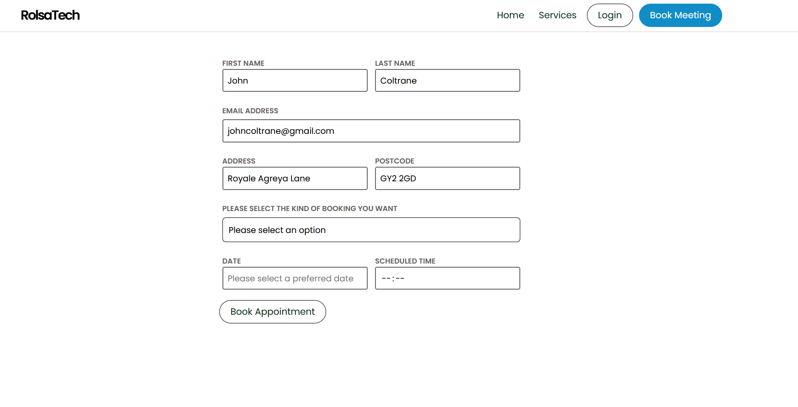

 First execute the sql commands as seen in the schema.session.sql file

 Then set up an .env  file in the root folder. It contains all your app credentials like password, database, user. They must be according to your MySQL configuration so you can be granted access.
 ie
 PORT, DB, PASSWORD, USER, HOST all under the follwing aliases

 After all that, run the following commnaand in the integrated terminal

 --npm install-- This will install all package dependencies for the project. None are harmful or contain virsuses. You can ignore warnings unless its a patch. After all packages have been installed the node_modules folder should appear in the same directory under 'node_modules' After that execute the folowing command inside the integrated terminal

-- npm run server --

This starts up a server on the PORT as spectified in the .env file and you should see this in the terminal:

---[LISTENING...] on PORT---

And then go into the pages folder and hit this shortcut if you are on VSCode.

First hit --> Ctrl+Shift+X to open your Extensions
And then search 'Live Server'
When installed, go to 'index.html' and then enter

Alt+L+Alt+O

It should open the homepage

SUMMARY
 

 TERMINAL
 Set up MySQL

 npm install

 Set up .env 

 npm run server

 

 

